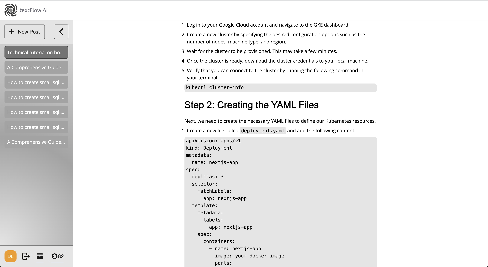
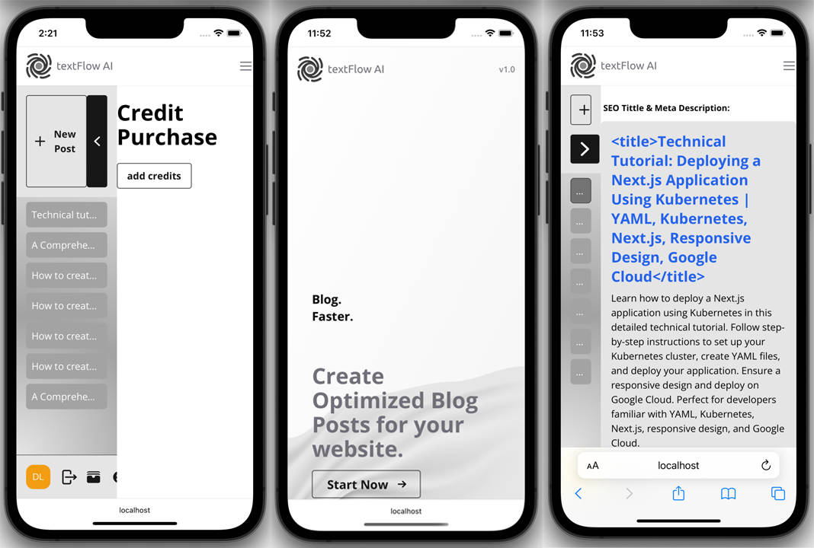

<p align="center">
  
</p>
<h2 align="center">textFlow</h2>

#### The app is built using NextJS, Stripe, and MongoDB, Auth0 and OpenAi with goal of creating a seamless blog generator. Not all features have been implemented in this project however this minimum viable product has core features like creating a user and storing users data such as credits used to generate the blogs, the blogs and credentials is implemented. Additionally, for secure processing of payment Stripe used as a seamless payment processing and user credit management. [app screenshots](#demo)

## This is a [Next.js](https://nextjs.org/) project bootstrapped with [`create-next-app`](https://github.com/vercel/next.js/tree/canary/packages/create-next-app).

## Getting Started

First, run the development server:

```bash
npm run dev
# or
yarn dev
# or
pnpm dev
```

Open [http://localhost:3000](http://localhost:3000) with your browser to see the result.

You can start editing the page by modifying `pages/index.js`. The page auto-updates as you edit the file.

[API routes](https://nextjs.org/docs/api-routes/introduction) can be accessed on [http://localhost:3000/api/hello](http://localhost:3000/api/hello). This endpoint can be edited in `pages/api/hello.js`.

The `pages/api` directory is mapped to `/api/*`. Files in this directory are treated as [API routes](https://nextjs.org/docs/api-routes/introduction) instead of React pages.

This project uses [`next/font`](https://nextjs.org/docs/basic-features/font-optimization) to automatically optimize and load Inter, a custom Google Font.

## Learn More

To learn more about Next.js, take a look at the following resources:

- [Next.js Documentation](https://nextjs.org/docs) - learn about Next.js features and API.
- [Learn Next.js](https://nextjs.org/learn) - an interactive Next.js tutorial.

You can check out [the Next.js GitHub repository](https://github.com/vercel/next.js/) - your feedback and contributions are welcome!

# OpenAI's "Conversational AI" framework is designed to facilitate dynamic and interactive conversations.

## Roles:

User: The User is you or the person interacting with the system. You provide input to the conversation and receive responses from the Assistant. Your inputs can be in the form of messages or prompts, and they guide the direction of the conversation.

Assistant: The Assistant is the language model, such as GPT-3.5-turbo, which generates responses based on the conversation's context. It takes the messages from both the User and the System as input and generates a coherent and contextually relevant response. The Assistant's responses are designed to simulate natural conversation.

System: The System is a part of the conversational setup that helps guide the behavior of the Assistant. It provides high-level instructions or context to the Assistant, helping it stay on topic or adopt a specific tone. The System's role is to influence the style, content, or behavior of the Assistant throughout the conversation.

# This project uses MongoDB Atlas

## MongoDB Atlas:

MongoDB Atlas is a Database as a Service (DBaaS) provided by MongoDB, Inc. It's a cloud-based platform designed to simplify the deployment, scaling, and management of MongoDB databases.

MongoDB Atlas offers a fully managed and automated MongoDB service in the cloud. You don't need to worry about infrastructure provisioning, setup, or day-to-day operations.

It provides features like automated backups, scaling, monitoring, security, and integration with other cloud services (e.g., AWS, Azure, Google Cloud).

MongoDB Atlas is particularly useful when you want to focus more on developing your application and less on managing the underlying database infrastructure.

## Demo <a name="demo"></a>

<p align="center">
  
</p>

<p align="center">
  
</p>

<p align="center">
  
</p>
